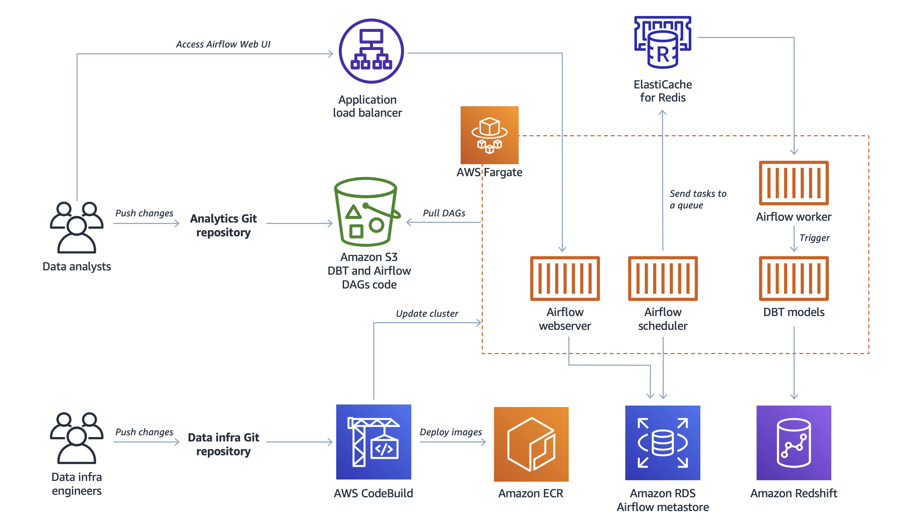

# DataOps Platform with Apache Airflow and dbt on AWS

### [View all Roadmaps](https://github.com/nholuongut/all-roadmaps) &nbsp;&middot;&nbsp; [Best Practices](https://github.com/nholuongut/all-roadmaps/blob/main/public/best-practices/) &nbsp;&middot;&nbsp; [Questions](https://www.linkedin.com/in/nholuong/)
 

This repository contains code to deploy the architecture described in the blog post: [*"Build DataOps platform to break silos between engineers and analysts"*](https://aws.amazon.com/tr/blogs/big-data/build-a-dataops-platform-to-break-silos-between-engineers-and-analysts/?nc1=h_ls&advocacy_source=everyonesocial&trk=global_employee_advocacy&sc_channel=sm&es_id=ab2ae17684).

---

## Architecture overview

The architecture includes following AWS services:
* **Amazon Elastic Container Service**, to run *Apache Airflow* and *dbt*
* **Amazon Elastic Container Repository**, to store Docker images for *Airflow* and *dbt*
* **Amazon Redshift**, as data warehouse
* **Amazon Relational Database System**, as [metadata store](https://airflow.apache.org/docs/stable/howto/initialize-database.html) for *Airflow*
* **Amazon ElastiCache for Redis**, as a [Celery backend](https://airflow.apache.org/docs/1.10.1/howto/executor/use-celery.html) for *Airflow*
* **Amazon Simple Storage Service**, to store *Airflow* and *dbt* DAGs
* **AWS CodeBuild** (optional), automate deployments

## Repository structure

In this repository there are two main project folders: [`dataops-infra`](dataops-infra) and [`analytics`](analytics). This setup is meant to demonstrate how DataOps can foster effective collaboration between data engineers and data analysts, separating the platform infrastructure code from the business logic. 

These two folders should be considered as two separate repositories following their own release cycles.

### DataOps Platform Infrastructure

The `dataops-infra` folder contains code and intructions to deploy the platform infrastructure described in the [**Architecture overview**](#architecture-overview) section. This project is created from the prospective of a data engineering team that is responsible for creating and maintaining data infrastructure such as data lake, data warehouse, orchestration, and CI/CD pipelines for analytics.

### Analytics 

The `analytics` folder contains code and instructions to manage and deploy *Airflow* and *dbt* DAGs on the DataOps platform. This project is created from the prospective of a data analytics team composed of data analysts and data scientists. They have domain knowledge and are responsible for serving analytics requests from different stakeholders such as marketing and business development teams so that company can make data driven decisions.

## 🚀 I'm are always open to your feedback🇻🇳🇻🇳🇻🇳🇻🇳🇻🇳🇻🇳🇻🇳🇻🇳🇻🇳🇻🇳🇻🇳🇻🇳🇻🇳🇻🇳🇻🇳🇻🇳

# **[Contact Me🇻🇳🇻🇳🇻🇳🇻🇳🇻🇳🇻🇳🇻🇳]**
* [Name: Nho Luong]
* [Skype](luongutnho_skype)
* [Github](https://github.com/nholuongut/)
* [Linkedin](https://www.linkedin.com/in/nholuong/)
* [Email Address](luongutnho@hotmail.com)
* [PayPal.Me](https://www.paypal.com/paypalme/nholuongut)

# License🇻🇳🇻🇳🇻🇳🇻🇳🇻🇳🇻🇳🇻🇳🇻🇳
* Nho Luong (c). All Rights Reserved.🌟
